## Advance Web – Ads SaaS Platform

Full-stack advertisement management SaaS built with:
- Express.js + TypeScript backend
- Next.js + React + Tailwind CSS frontend
- Supabase (Postgres, Auth, Storage) as the data layer

This README is the single source of documentation for setup, architecture, and deployment.

---

## 1. Features Overview

- Client-facing ad creation, editing, and dashboard
- Moderator review queue and actions (approve/reject/flag)
- Admin moderation queue and payment verification
- Package management and payments tracking
- Search, categories, cities, and analytics
- Supabase Auth with GitHub OAuth and role-based access (client, moderator, admin)

---

## 2. Project Structure

```text
backend/
  src/
    config/         # env + Supabase client
    features/       # one folder per domain feature
    routes/         # central router, mounts all features
    shared/         # middleware, utils, types
    index.ts        # Express app entry

frontend/
  app/             # Next.js App Router
  components/      # shared UI components
  lib/             # auth + Supabase helpers
  public/          # static assets
  README.md        # Next.js template README (unused)
```

### Backend Feature Modules

Mounted in [backend/src/routes/index.ts](backend/src/routes/index.ts):

- `/auth` – Supabase-backed auth flows
- `/ads` – CRUD and status changes for ads
- `/search` – search APIs
- `/categories`, `/cities` – taxonomy endpoints
- `/packages` – packages/pricing
- `/admin/payments` & `/admin` – admin dashboards and actions
- `/analytics` – reporting endpoints
- `/moderator` – moderator review queue
- `/cron` – scheduled jobs
- `/questions` – learning/questions feature

The Express app entry is [backend/src/index.ts](backend/src/index.ts).

---

## 3. Tech Stack

- **Backend**: Node.js, Express.js, TypeScript, Supabase client
- **Frontend**: Next.js (App Router), React, TypeScript, Tailwind CSS
- **Database/Auth**: Supabase (PostgreSQL + Auth + Storage)

---

## 4. Environment Variables

### Backend (`backend/.env`)

Validated in [backend/src/config/env.ts](backend/src/config/env.ts):

```env
PORT=4000
SUPABASE_URL=https://your-project.supabase.co
SUPABASE_ANON_KEY=your-public-anon-key
SUPABASE_SERVICE_ROLE_KEY=your-service-role-key
FRONTEND_URL=http://localhost:3000
NODE_ENV=development
SENDGRID_API_KEY=optional
SENDGRID_FROM_EMAIL=noreply@adflowpro.com
```

### Frontend (`frontend/.env.local`)

```env
NEXT_PUBLIC_SUPABASE_URL=https://your-project.supabase.co
NEXT_PUBLIC_SUPABASE_PUBLISHABLE_KEY=your-public-anon-key
NEXT_PUBLIC_BACKEND_URL=http://localhost:4000
```

Supabase keys are obtained from your project’s **Settings → API** page.

---

## 5. Local Development

### Prerequisites

- Node.js 18+
- pnpm (recommended)
- Supabase project (hosted or local)

### Backend

```bash
cd backend
pnpm install
pnpm dev
```

Backend runs at: http://localhost:4000

### Frontend

```bash
cd frontend
pnpm install
pnpm dev
```

Frontend runs at: http://localhost:3000

Run both servers in parallel during development.

---

## 6. Supabase & GitHub OAuth (Auth)

Authentication is implemented using Supabase Auth with GitHub OAuth.

High-level steps:

1. **Create GitHub OAuth app**
   - Homepage URL: `http://localhost:3000`
   - Authorization callback URL: `http://localhost:3000/auth/callback`
2. **Enable GitHub provider in Supabase**
   - Paste GitHub Client ID and Secret into Supabase Auth → Providers → GitHub
3. **Configure Supabase keys**
   - Use Supabase project URL, anon key, and service role key in backend and frontend env files.

Backend uses a Supabase service-role client in `config/supabase.ts` and exposes `/api/v1/auth` endpoints (sign-in, callback, refresh, me, logout). Frontend uses a Supabase browser client and Auth context to manage sessions.

---

## 7. Running the Full Stack

In two terminals:

```bash
# Terminal 1 – backend
cd backend
pnpm dev

# Terminal 2 – frontend
cd frontend
pnpm dev
```

Then open http://localhost:3000 in your browser.

---

## 8. Deployment (Vercel + Supabase)

### Frontend (Vercel)

1. Push this repo to GitHub.
2. In Vercel, **Import Project** from GitHub.
3. Set **Root Directory** to `frontend`.
4. Build command: `pnpm build` (or leave blank and let Vercel auto-detect).
5. Add environment variables from `.env.local` in Vercel Project Settings.

### Backend

For production, deploy the Express backend to a Node-friendly host (Render, Railway, Fly.io, etc.):

- Build/start commands are defined in `backend/package.json`.
- Remember to set the same env vars as in development.
- Update `NEXT_PUBLIC_BACKEND_URL` in Vercel to point to your deployed backend URL.

### Supabase

- Create project and run SQL migrations from:
  - [backend/src/db](backend/src/db) (backend migrations)
  - [frontend/supabase/migrations](frontend/supabase/migrations) (frontend-side schema/RLS)
- Ensure Storage buckets (e.g. `payment_proofs`) exist and RLS policies are configured.

---

## 9. Troubleshooting

- **`pnpmbuild: command not found` on Vercel**
  - Set build command to `pnpm build` (with a space) in Vercel.
- **CORS errors**
  - Check `FRONTEND_URL` in backend `.env` matches your frontend origin.
- **Supabase RLS errors (403)**
  - Verify policies for the table and that the JWT contains correct `user_metadata.role`.
- **OneDrive path issues**
  - If you see permission problems, consider moving the repo to a non-OneDrive folder.

---

## 10. Screenshots

Below are key UI screens from the application:

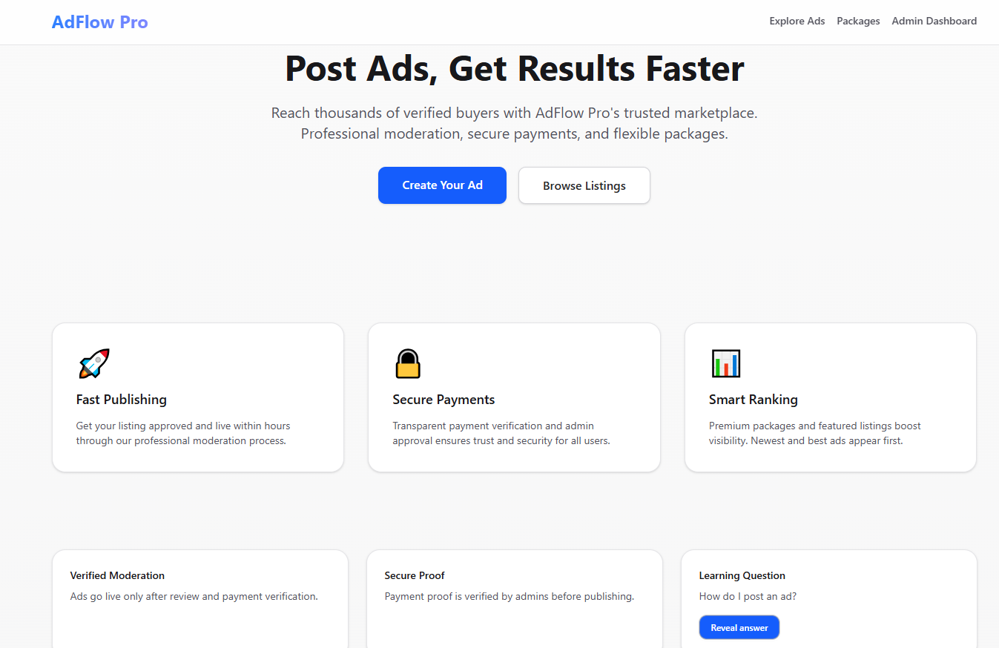
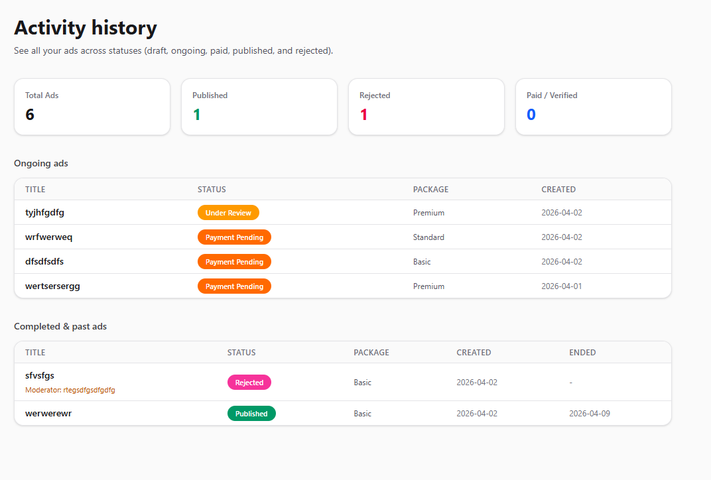
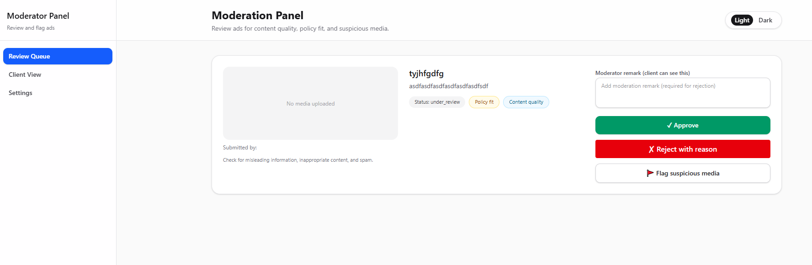
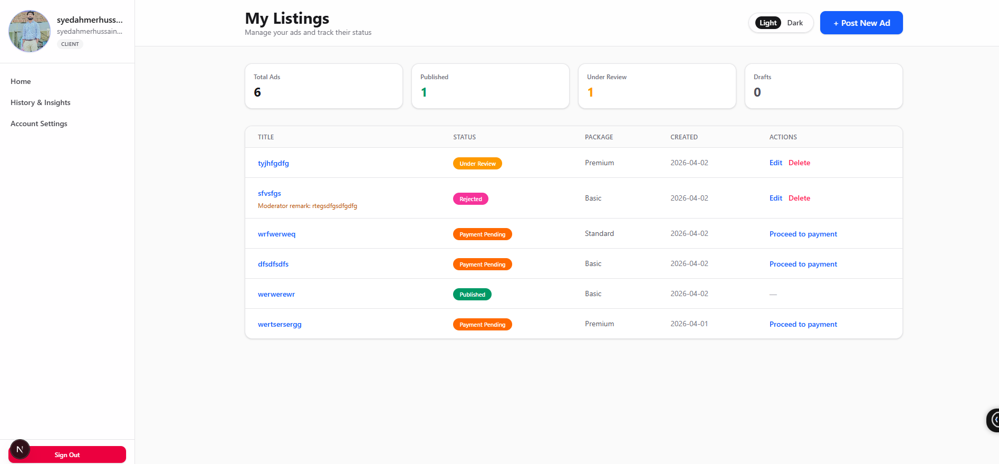
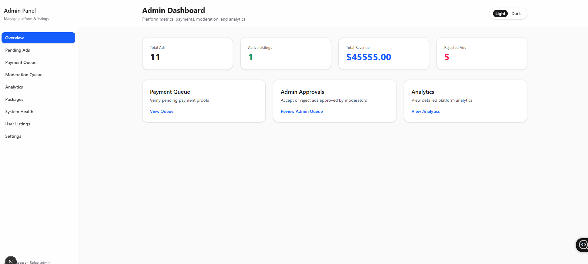
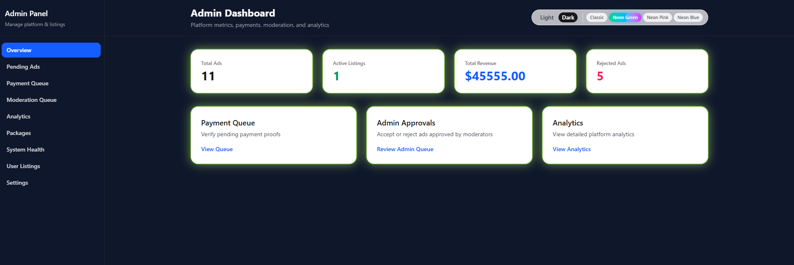
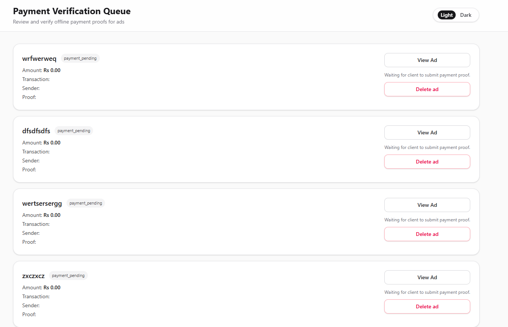
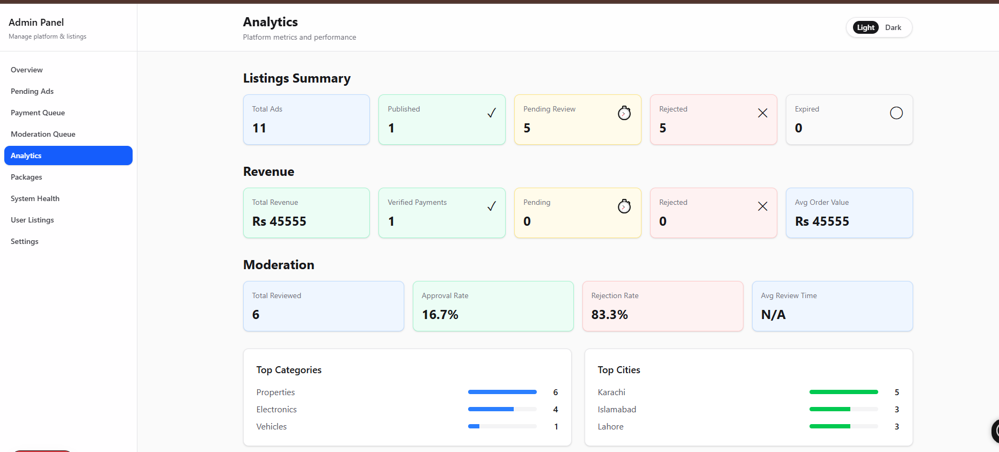
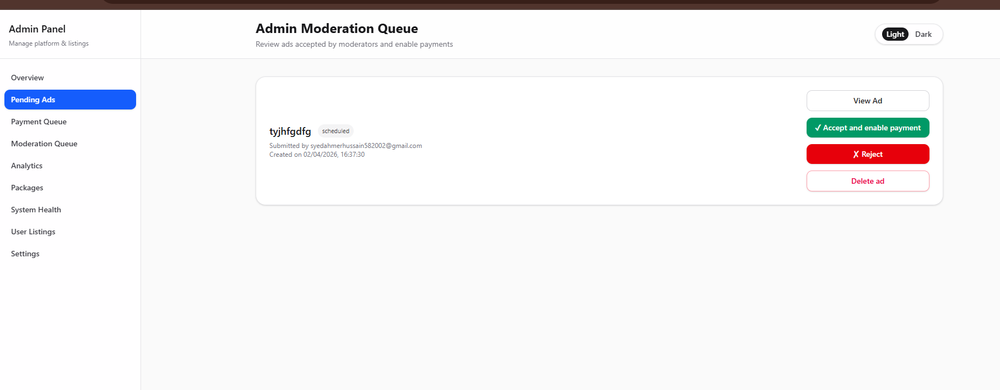
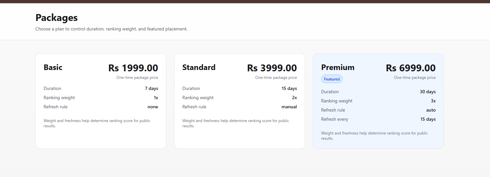
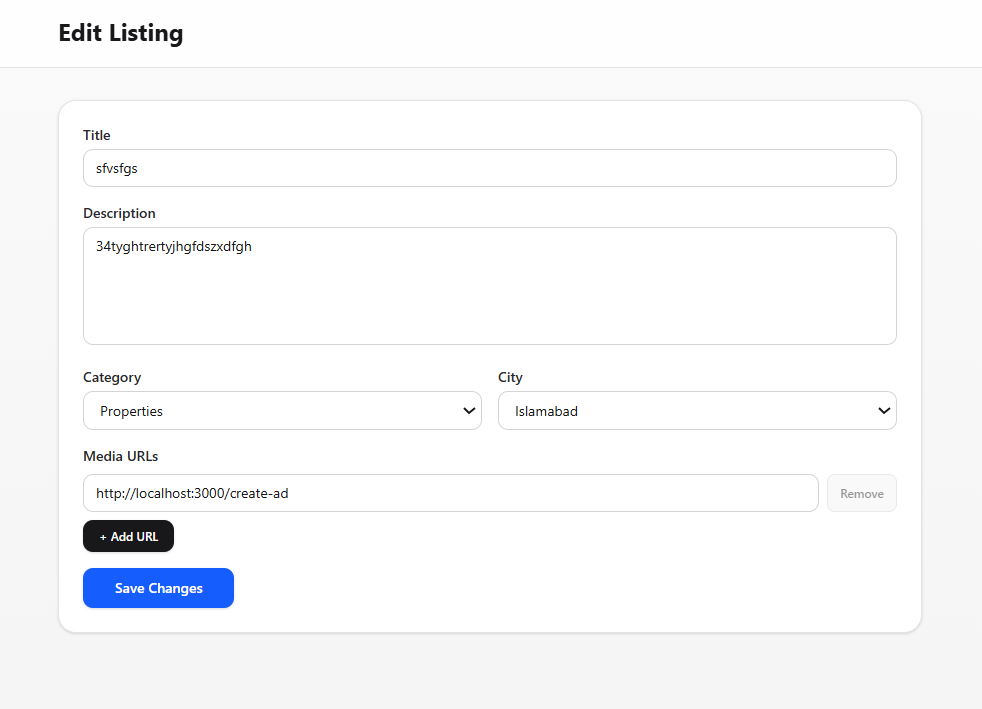
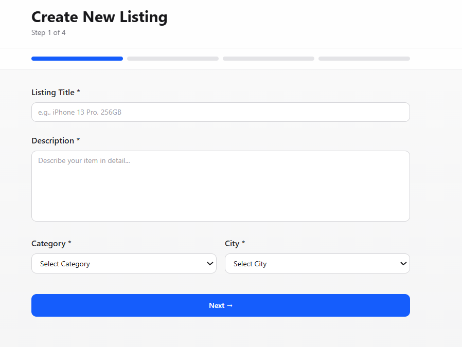
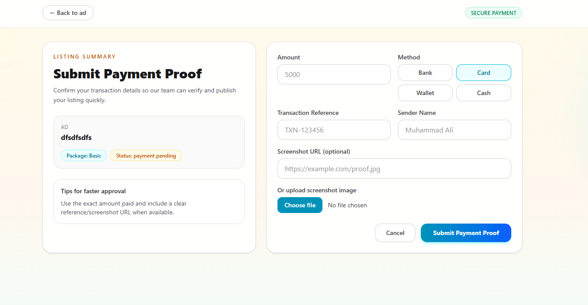

---

## 11. Status

- ✅ Local development setup complete
- ✅ Backend and frontend integrated
- ✅ Supabase-based auth and data layer wired in
- ✅ Ready for further feature development and production hardening

